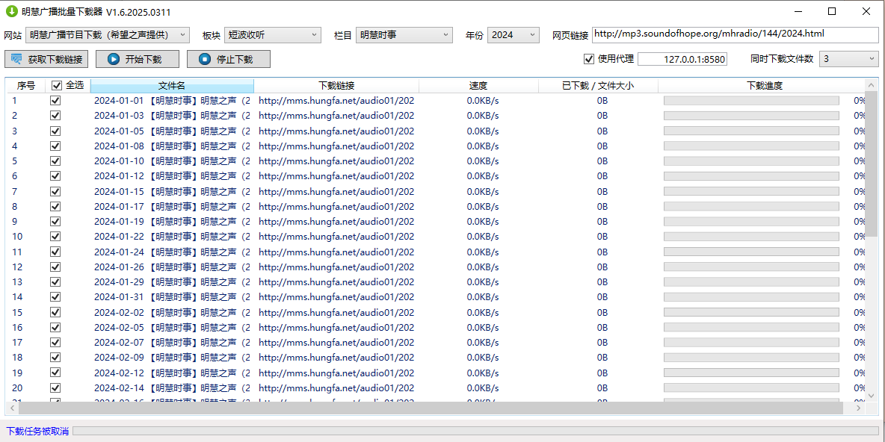

# 明慧廣播批量下載器

## 一、功能簡介

本專案為了方便批量下載明慧廣播MP3節目，廣傳真相所用。

明慧廣播下載，支持兩個源，一個是明慧廣播官網（mhradio.org），當前提供的是32Kbps品質的MP3音訊檔（大約2021年前的MP3是128Kbps的）；另一個是希望之聲（mp3.soundofhope.org/mhradio/）提供的16Kbps品質的MP3音訊檔。希望之聲的源為16Kbps，品質完全滿足通常的音質要求，且體積相比當前明慧廣播官網的小一半，是網路不好情況下，從大陸下載的首選源。

使用和操作簡單，一次可以同時下載多個節目，且下載均可記憶上次下載位置，下次繼續從中斷點下載。
 
## 二、開發環境等

|  類別  |說明|
| :---   | :---        |
|開發工具	|VS2022 社區版|
|語言|C#|
|DotNet|8.0|
|Nuget引用庫|HtmlAgilityPack, HtmlAgilityPack.CssSelectors.NetCore, Microsoft.NETFramework.ReferenceAssemblie, NETStandard.Library, Newtonsoft.Json|
|添加且修改的專案|Downloader，根據代碼需要做了適當修改|

## 三、使用前的準備

使用前程式需要做好的準備： 

1、安裝微軟net Core8的桌上出版程式運行時，下載位址：
https://download.visualstudio.microsoft.com/download/pr/f18288f6-1732-415b-b577-7fb46510479a/a98239f751a7aed31bc4aa12f348a9bf/windowsdesktop-runtime-8.0.1-win-x64.exe

2、如果使用自由門限製版下載，需按照第3部分【添加自由門白名單】，把如下內容添加到其代理的白名單裡：
- .hungfa.net

3、【添加自由門白名單】的方法
（1）在自由門介面點擊“設置”(圖示為齒輪形狀的)；
（2）在設置視窗，點擊“自由門代理控制”按鈕；
（3）在自由門代理控制視窗，在第三個“只允許通過……”的旁邊，點擊“添加”按鈕，把上面的連接依次逐個輸入進去，記得前面有個小點。然後一路點擊確定就好了。

## 四、使用簡要說明

### 【提示】
如果系統預先沒有安裝微軟net Core8運行時，運行程序后，系統會出現下載提示，

請點擊“Download it now”下載並安裝。

### 本程序操作簡單，只需四步即可批量下載明慧廣播的MP3檔：

### （一）通過明慧廣播官網下載

1、在“網站”選擇“明慧廣播電臺”，程式會自動更新相關資料；
2、選擇需要的“板塊”、“欄目”和“頁序”，就會自動得到“網頁連結”；
3、點擊“獲取下載連接”按鈕，獲得實際的下載連接檔資訊；
4、根據需要，全選或選擇部分文件，點擊“開始下載”按鈕下載音訊檔。

### （二）通過希望之聲下載

1、在“網站”選擇“明慧廣播電臺（希望之聲提供）”；
2、選擇需要的“板塊”、“欄目”和“年份”，就會自動得到“網頁連結”；
3、點擊“獲取下載連接”按鈕，獲得實際的下載連接檔資訊；
4、根據需要，全選或選擇部分文件，點擊“開始下載”按鈕下載音訊檔。

所有下載檔案，直接保存在程式目前的目錄同一位置下的“下載”目錄裡。

## 五、所使用或引用的專案

1、Downloader
https://github.com/bezzad/Downloader

### 誠心感謝作者的付出！

## 六、更新

【20250425】
1. 更新 bezzad Downloader 代碼到最新的 v3.3.4；
2. 添加F5鍵更新功能。主要用於網絡不好或代理失效等情況下，導致的網站板塊、欄目、頁序或年份信息不全的問題，這時在檢查網絡正常和代理正確的情況下，可以按下F5來强制更新這些信息；
3. 各方面細節的完善。

## 七、鄭重聲明

#### 本項目僅為廣泛傳播明慧廣播真相節目，讓眾人明真相所用而特別製作。
#### 下載的所有節目，請尊重節目的版權，請勿修改其任何內容，保證節目的完整。
#### 對於利用所下載的節目拼接、修改等以達到其各種不善目的的，請懸崖勒馬。蒼天在上，莫要做此等壞事，害己害人，絕不可取。
#### 對於下載節目，用於廣傳真相的可貴的善良的世人，感謝您的付出！您的善舉將會給您帶來美好的未來！

